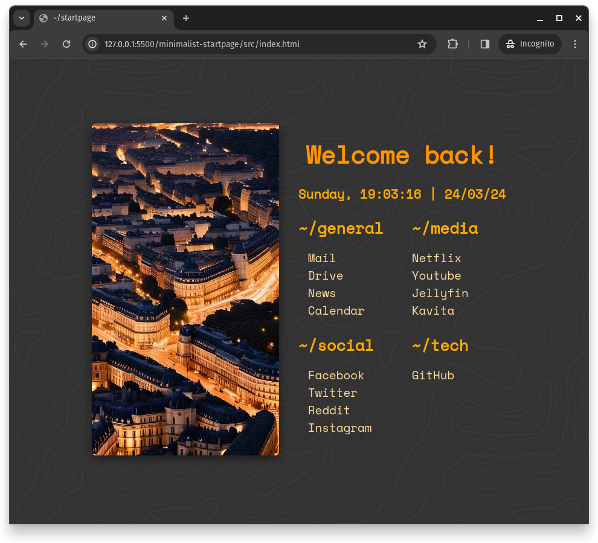

# Minimalist Startpage

Minimalist Webbrowser start page with orange accent color.

## 📥 Installation

1. Download latest version from [Release](https://github.com/Ni-g-3l/minimalist-startpage/releases)
2. Extract it
3. Update your links
3. Update your pictures
4. Publish with Github Page

## 🤹 Authors / Contributers / Attributions

* **Ni-g-3l** - *Main Developer* - [Github](https://github.com/Ni-g-3l/)

See also the list of [contributors](https://github.com/Ni-g-3l/minimalist-startpage/contributors) who participated in this project.

## 📃 License

This project is licensed under the MIT License - see the [LICENSE](LICENSE) file for details.

## 👏 Acknowledgments

* **Billie Thompson** - *README & Contribution Templates* - [PurpleBooth](https://github.com/PurpleBooth)
* **Fazzi** - *Base start page* - [startpage](https://gitlab.com/fazzi/startpage/)
